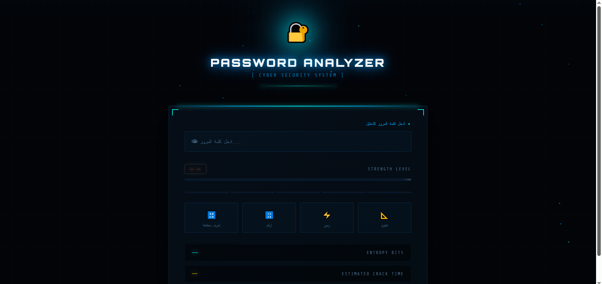
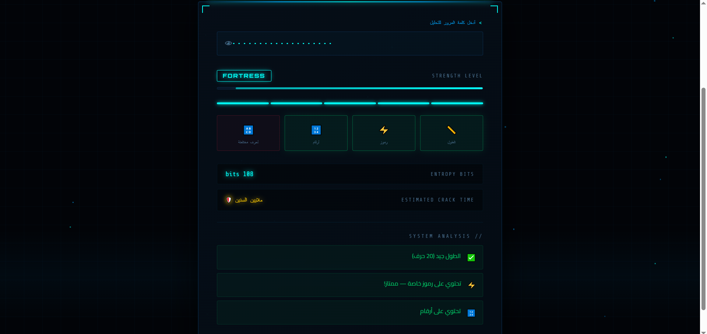
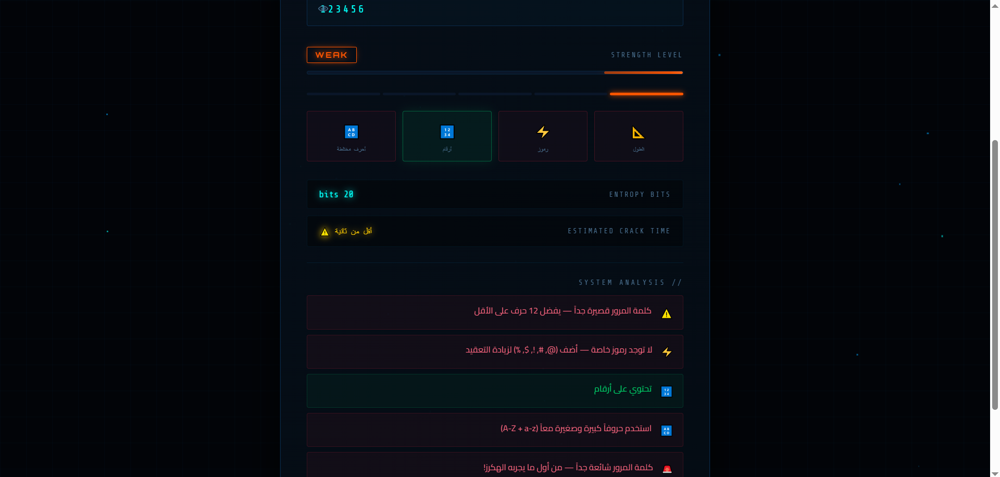

# 🔐 Password Strength Checker

A cybersecurity-themed password strength analyzer that supports both Arabic and English characters. It evaluates passwords in real time based on length, character variety, entropy, and common weakness patterns, with instant visual feedback.

## KeyShield 



## Overview
This project helps users create stronger and safer passwords. It analyzes password strength using multiple security criteria and presents the results through an immersive cyber-style interface, including a strength meter, entropy score, and estimated crack time.

## Features
- Supports both Arabic and English characters
- Evaluates password strength based on length
- Checks character variety, including uppercase, lowercase, numbers, and special symbols
- Detects common weakness patterns such as repeated characters and predictable sequences like `123`, `abc`, and `qwe`
- Includes a blacklist of common passwords such as `password`, `123456`, `محمد`, and `admin`
- Calculates entropy bits to estimate password randomness
- Estimates crack time based on a simulated GPU brute-force attack
- Provides real-time feedback and improvement tips
- Includes a show/hide password toggle
- Fully responsive for both mobile and desktop devices

## Technologies Used
- HTML
- CSS
- JavaScript

## How It Works
The user enters a password, and the system instantly analyzes it based on several factors, including password length, character variety, common weakness patterns, blacklist matching, entropy, and estimated crack time.

The password strength is then displayed as one of five levels:

**CRITICAL → WEAK → FAIR → STRONG → FORTRESS**

## Project Structure
```bash
password-checker/
├── index.html
├── style.css
└── script.js
